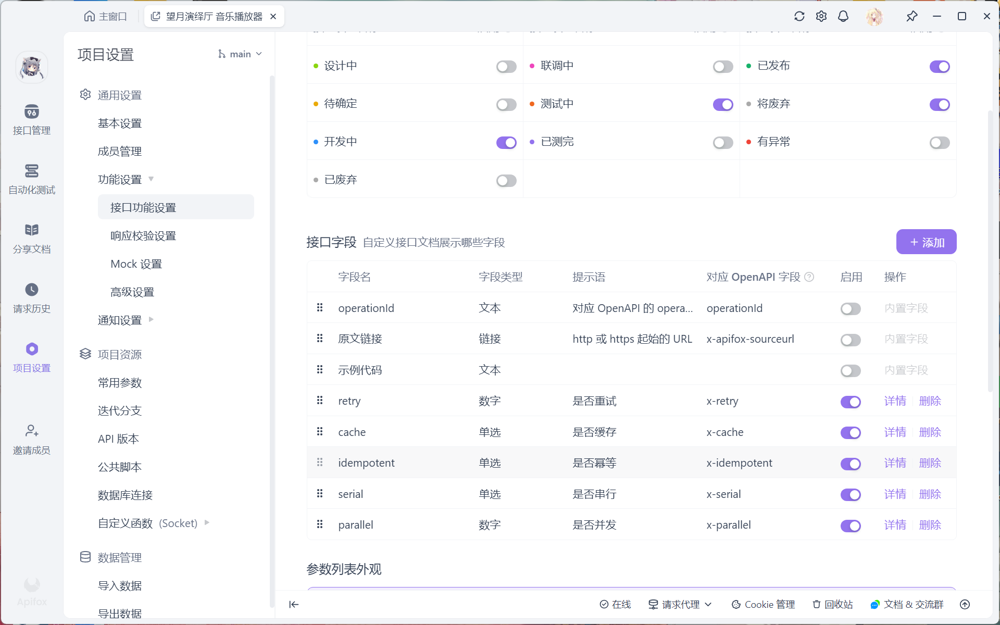
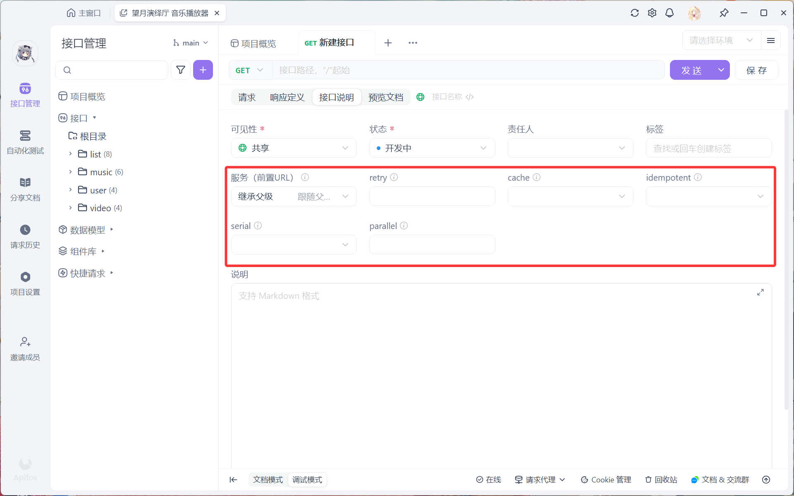

# request-template-cli

## 简介

基于 apifox openapi v3.0 协议生成的 json 文件, 为 mitsuki-request-lib 批量生成接口代码

## 接口平台

通过 apifox 接口平台可以自定义一些字段





同时，接口平台提供了生成标准格式的功能，通过该功能即可生成标准的JSON描述文件(openapi v3.0+)

```json
"paths": {
    "/api/list/add": {
        "post": {
            "summary": "addOneMusicToListService",
            "deprecated": false,
            "description": "将一首音乐添加到列表中",
            "tags": [
            "list"
            ],
            "parameters": [],
            "requestBody": {
            "content": {
                "application/json": {
                "schema": {
                    "$ref": "#/components/schemas/AddOneMusicToListRequest"
                },
                "example": ""
                }
            }
            },
            "responses": {
            "200": {
                "description": "",
                "content": {
                "application/json": {
                    "schema": {
                    "type": "object",
                    "properties": {
                        "message": {
                        "type": "string"
                        }
                    },
                    "x-apifox-orders": [
                        "message"
                    ],
                    "required": [
                        "message"
                    ],
                    "x-apifox-ignore-properties": []
                    }
                }
                },
                "headers": {},
                "x-apifox-name": "成功"
            }
            },
            "security": [],
            "x-retry": 3,
            "x-cache": "false",
            "x-idempotent": "false",
            "x-serial": "false",
            "x-parallel": 0,
            "x-apifox-folder": "list",
            "x-apifox-status": "released",
            "x-apifox-maintainer": "百濑美月",
            "x-run-in-apifox": "https://app.apifox.com/web/project/7265483/apis/api-369449997-run"
        }
    }
    // ...
}
```

## 使用

1. 安装依赖
```powershell
pnpm install
```

2. 构建打包代码
```powershell
tsup
```

3. 将json文件命名为openapi.json放置在目录并运行
```powershell
npx generate
```

你会得到以下文件夹结构
```
├─request-bus
│    ├─@types        # 类型文件
│    ├─template      # 接口文件夹
│    └─patch         # 补丁文件夹
```

模板代码

```typescript
// request-bus/template/list.ts
import type { AddOneMusicToListRequest } from "../@types";
import { requestor } from "../../request-imp/request-fetch-imp";
import { inject, useRequestor, createRetryRequestor } from "../../request-core";

inject(requestor);
const req = useRequestor();

export const addOneMusicToListService = (() => {
	const req = createRetryRequestor(3);
	return async (data: AddOneMusicToListRequest) => {
		return req.post("/api/list/add", data).then((resp) =>
			resp.json<{
				message: string;
			}>()
		);
	};
})();
```

## 补丁

有时候样板代码可能不能满足需求，需要手动进行改动。

我们可以使用打补丁的方式去修改样板代码，做法非常简单。

```typescript
// /request-bus/patch/list.ts
import type { AddOneMusicToListRequest } from "../@types";
import { requestor } from "../../request-imp/request-fetch-imp";
import { inject, useRequestor, createRetryRequestor } from "../../request-core";

inject(requestor);
const req = useRequestor();

export const addOneMusicToListService = (() => {
	const req = createRetryRequestor(3);
	return async (data: AddOneMusicToListRequest) => {
		return req.post("/api/list/add", data).then((resp) =>
			resp.json<{
				message: string;
			}>()
		);
	};
})();
```

```typescript
// /request-bus/patch/index.ts
export * from "./list"
```

在 ```/request-bus/index.ts``` 新增导出

```typescript
export * from "./template"
// 这里会覆盖掉 template 里的 addOneMusicToListService
export { addOneMusicToListService } from "./patch"
```
